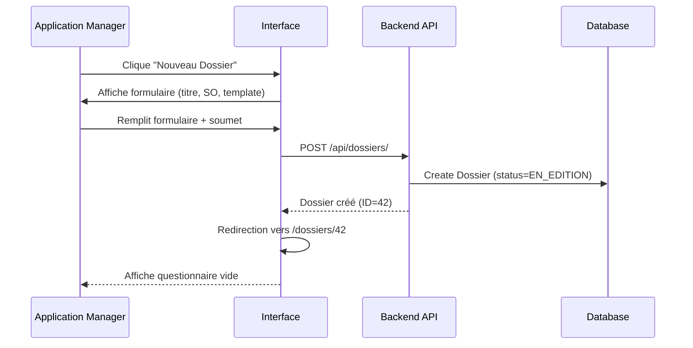
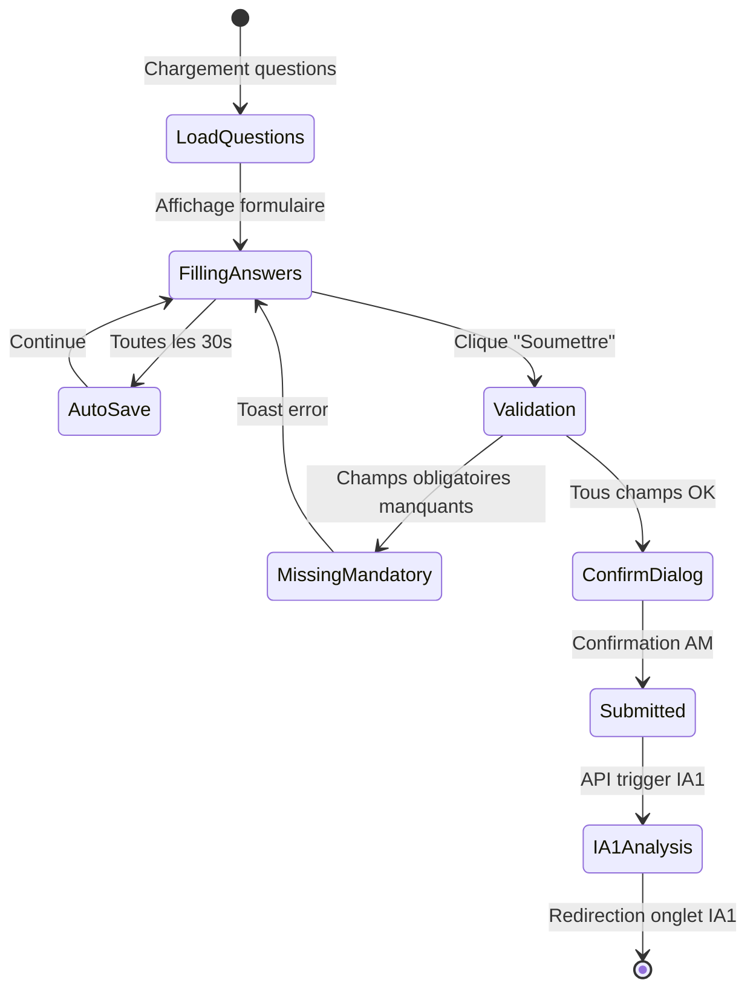
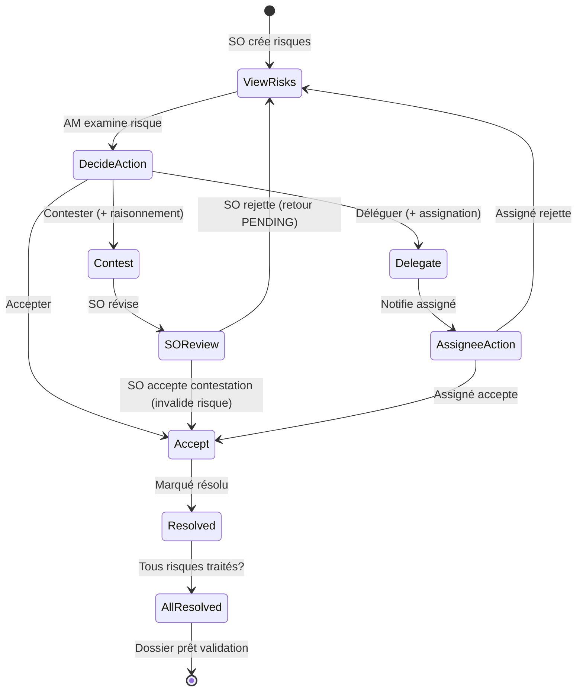
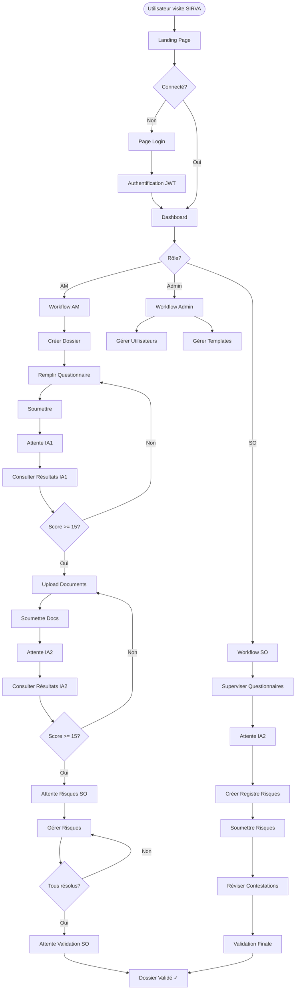
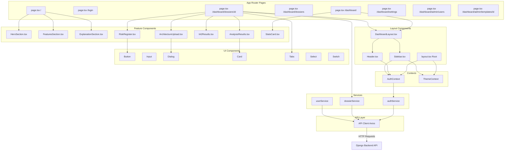
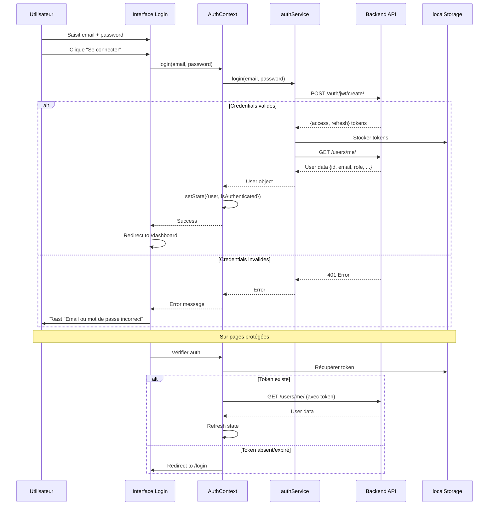
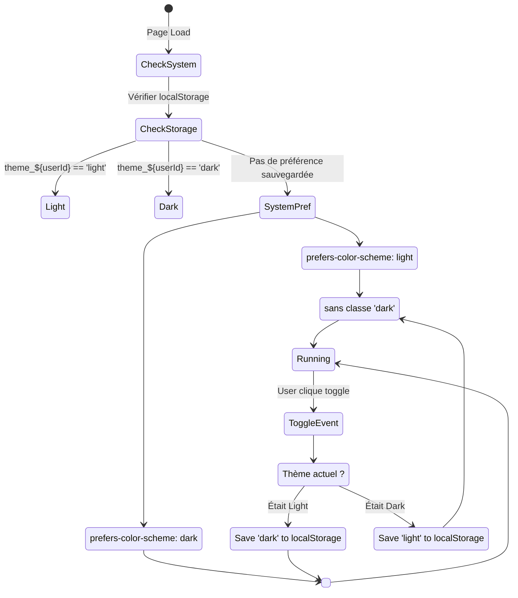
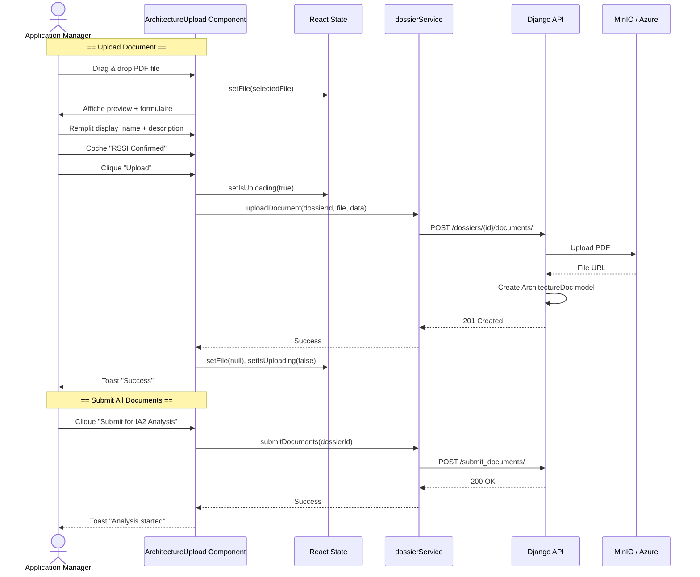

# SIRVA Frontend - Interface Utilisateur de la Plateforme d'Évaluation de Sécurité

## 📋 Table des Matières

1. [Présentation](#-présentation)
2. [Architecture Technique](#architecture-technique)
3. [Technologies Utilisées](#technologies-utilisees)
4. [Structure du Projet](#-structure-du-projet)
5. [Composants Principaux](#-composants-principaux)
6. [Gestion d'État](#gestion-detat)
7. [Workflows Utilisateur](#-workflows-utilisateur)
8. [Pages et Routes](#-pages-et-routes)
9. [Intégration API](#-intégration-api)
10. [Installation et Configuration](#-installation-et-configuration)
11. [Déploiement](#-déploiement)
12. [Diagrammes](#-diagrammes)

---

## 🎯 Présentation

**SIRVA Frontend** est l'interface utilisateur moderne de la plateforme SIRVA (Security Information Risk Validation Assessment). Développée avec Next.js 14 et TypeScript, elle offre une **expérience utilisateur fluide et intuitive** pour la gestion complète des évaluations de sécurité applicative.

### Vue d'Ensemble

L'interface permet à trois types d'utilisateurs de collaborer efficacement :

- **Application Managers (AM)** : Créent des dossiers, répondent aux questionnaires, gèrent les risques
- **Security Officers (SO)** : Valident les évaluations, créent les registres de risques, effectuent les validations finales
- **Administrateurs** : Gèrent les utilisateurs, créent et modifient les templates de questionnaires

### Fonctionnalités Clés

✨ **Interface Moderne** : Design épuré avec mode sombre complet
🔐 **Authentification JWT** : Sécurité renforcée avec gestion de tokens
📊 **Tableaux de Bord Dynamiques** : Statistiques temps réel par rôle
📱 **Responsive Design** : Compatible mobile, tablette et desktop
🎨 **Thème Personnalisable** : Mode clair/sombre persistant par utilisateur
♿ **Accessibilité** : Conformité WCAG avec ARIA labels
🚀 **Performance Optimisée** : SSR, lazy loading, optimisation d'images

---

## 🏗️ Architecture Technique <a id="architecture-technique"></a>

### Stack Frontend

```
┌─────────────────────────────────────────────────────────────┐
│                   SIRVA Frontend Stack                       │
├─────────────────────────────────────────────────────────────┤
│  Framework      │ Next.js 14+ (App Router)                  │
│  Langage        │ TypeScript 5.x                            │
│  Styling        │ Tailwind CSS 3.4 + Custom Components     │
│  UI Library     │ shadcn/ui (Radix UI primitives)          │
│  State          │ React Context API + Hooks                │
│  HTTP Client    │ Axios (via custom API client)            │
│  Notifications  │ Sonner (Toast library)                   │
│  Icons          │ Lucide React                              │
│  Validation     │ Client-side + Server confirmation        │
└─────────────────────────────────────────────────────────────┘
```

### Architecture en Couches

```
┌──────────────────────────────────────────────────────┐
│                  Presentation Layer                  │
│  ┌────────────────────────────────────────────────┐ │
│  │  Pages (Next.js App Router)                    │ │
│  │  - Landing, Dashboard, Dossiers, Admin        │ │
│  └────────────┬───────────────────────────────────┘ │
└───────────────┼──────────────────────────────────────┘
                │
┌───────────────▼──────────────────────────────────────┐
│               Component Layer                        │
│  ┌────────────────────────────────────────────────┐ │
│  │  UI Components (shadcn/ui)                     │ │
│  │  - Button, Input, Dialog, Card, etc.          │ │
│  ├────────────────────────────────────────────────┤ │
│  │  Feature Components                            │ │
│  │  - AnalysisResults, ArchitectureUpload,       │ │
│  │    RiskRegister, HeroSection, etc.            │ │
│  └────────────┬───────────────────────────────────┘ │
└───────────────┼──────────────────────────────────────┘
                │
┌───────────────▼──────────────────────────────────────┐
│               Business Logic Layer                   │
│  ┌────────────────────────────────────────────────┐ │
│  │  Services (API Interaction)                    │ │
│  │  - authService, dossierService, etc.          │ │
│  ├────────────────────────────────────────────────┤ │
│  │  Context Providers                             │ │
│  │  - AuthContext, ThemeContext                   │ │
│  └────────────┬───────────────────────────────────┘ │
└───────────────┼──────────────────────────────────────┘
                │
┌───────────────▼──────────────────────────────────────┐
│               Data Layer                             │
│  ┌────────────────────────────────────────────────┐ │
│  │  API Client (Axios)                            │ │
│  │  - HTTP interceptors, Token management        │ │
│  ├────────────────────────────────────────────────┤ │
│  │  TypeScript Interfaces                         │ │
│  │  - User, Dossier, Question, RiskItem, etc.   │ │
│  └────────────┬───────────────────────────────────┘ │
└───────────────┼──────────────────────────────────────┘
                │
                ▼
        Backend API (Django)
```

---

## 🛠️ Technologies Utilisées <a id="technologies-utilisees"></a>

### Dépendances Principales

```json
{
  "dependencies": {
    "next": "^15.0.0",
    "react": "^18.3.0",
    "react-dom": "^18.3.0",
    "typescript": "^5.0.0",
    "tailwindcss": "^3.4.0",
    "axios": "^1.6.0",
    "sonner": "^1.4.0",
    "lucide-react": "^0.400.0",
    "@radix-ui/react-dialog": "^1.0.5",
    "@radix-ui/react-select": "^2.0.0",
    "@radix-ui/react-switch": "^1.0.3",
    "@radix-ui/react-tabs": "^1.0.4",
    "clsx": "^2.1.0",
    "tailwind-merge": "^2.2.0"
  },
  "devDependencies": {
    "@types/node": "^20.0.0",
    "@types/react": "^18.3.0",
    "eslint": "^8.0.0",
    "postcss": "^8.4.0",
    "autoprefixer": "^10.4.0"
  }
}
```

### Choix Technologiques Justifiés

**Next.js 14 (App Router)** :
- ✅ SSR (Server-Side Rendering) pour SEO et performance
- ✅ File-based routing simplifié
- ✅ API routes intégrées
- ✅ Image optimization automatique

**TypeScript** :
- ✅ Type safety pour éviter les bugs
- ✅ Intellisense amélioré
- ✅ Refactoring facilité
- ✅ Documentation inline avec types

**Tailwind CSS** :
- ✅ Utility-first pour rapidité de développement
- ✅ Dark mode intégré (`dark:` prefix)
- ✅ Responsive design simplifié
- ✅ PurgeCSS automatique (bundle optimisé)

**shadcn/ui** :
- ✅ Composants accessibles (Radix UI)
- ✅ Personnalisables à 100%
- ✅ Pas de vendor lock-in
- ✅ TypeScript natif

---

## 📁 Structure du Projet

```
sirva-frontend/
├── public/                          # Assets statiques
│   └── assets/                      # Images, logos, etc.
│
├── src/
│   ├── app/                         # Next.js App Router
│   │   ├── page.tsx                 # Landing page (Hero + Features + Explanation)
│   │   ├── layout.tsx               # Root layout (Providers, fonts)
│   │   ├── login/
│   │   │   └── page.tsx             # Page de connexion
│   │   └── dashboard/
│   │       ├── page.tsx             # Dashboard principal (stats + dossiers récents)
│   │       ├── layout.tsx           # Layout dashboard (Header + Sidebar)
│   │       ├── settings/
│   │       │   └── page.tsx         # Paramètres utilisateur (profil, mot de passe, préférences)
│   │       ├── help/
│   │       │   └── page.tsx         # Documentation contextuelle par rôle
│   │       ├── dossiers/
│   │       │   ├── page.tsx         # Liste des dossiers
│   │       │   └── [id]/
│   │       │       └── page.tsx     # Détail dossier (5 onglets : Q, IA1, Docs, IA2, Risques)
│   │       └── admin/
│   │           ├── users/
│   │           │   └── page.tsx     # Gestion utilisateurs (CRUD)
│   │           └── templates/
│   │               ├── page.tsx     # Liste templates questionnaires
│   │               └── [id]/
│   │                   └── page.tsx # Éditeur template (CRUD questions)
│   │
│   ├── components/
│   │   ├── ui/                      # Composants de base shadcn/ui
│   │   │   ├── button.tsx
│   │   │   ├── input.tsx
│   │   │   ├── dialog.tsx
│   │   │   ├── card.tsx
│   │   │   ├── tabs.tsx
│   │   │   ├── select.tsx
│   │   │   ├── switch.tsx
│   │   │   └── ...
│   │   ├── layout/                  # Composants de structure
│   │   │   ├── Header.tsx           # En-tête avec user menu
│   │   │   ├── Sidebar.tsx          # Navigation latérale (rôle-based)
│   │   │   └── DashboardLayout.tsx  # Wrapper dashboard
│   │   ├── dashboard/               # Composants métier
│   │   │   ├── AnalysisResults.tsx  # Affichage résultats IA1
│   │   │   ├── IA2Results.tsx       # Affichage résultats IA2
│   │   │   ├── ArchitectureUpload.tsx # Upload + gestion documents PDF
│   │   │   ├── RiskRegister.tsx     # Gestion registre de risques
│   │   │   └── StatsCard.tsx        # Carte statistique dashboard
│   │   ├── HeroSection.tsx          # Section héro landing page
│   │   ├── FeaturesSection.tsx      # Grille de fonctionnalités
│   │   └── ExplanationSection.tsx   # Explication workflow 5 phases
│   │
│   ├── contexts/
│   │   ├── auth.context.tsx         # Gestion authentification + rôle utilisateur
│   │   └── theme.context.tsx        # Gestion thème (light/dark)
│   │
│   ├── services/
│   │   ├── auth.service.ts          # API calls authentification
│   │   ├── dossier.service.ts       # API calls dossiers
│   │   └── user.service.ts          # API calls utilisateurs
│   │
│   ├── types/
│   │   ├── dossier.ts               # Interfaces Dossier, Question, Answer
│   │   ├── user.ts                  # Interfaces User
│   │   └── risk.ts                  # Interfaces RiskRegister, RiskItem
│   │
│   ├── lib/
│   │   ├── api-client.ts            # Client HTTP Axios configuré
│   │   └── utils.ts                 # Fonctions utilitaires (cn, formatDate, etc.)
│   │
│   └── styles/
│       └── globals.css              # Styles globaux + Tailwind imports
│
├── .env.local                       # Variables d'environnement (gitignored)
├── .env.example                     # Template variables d'environnement
├── next.config.mjs                  # Configuration Next.js
├── tailwind.config.ts               # Configuration Tailwind CSS
├── tsconfig.json                    # Configuration TypeScript
├── package.json                     # Dépendances et scripts
├── docker-compose.yml               # Configuration Docker
├── Dockerfile                       # Image Docker frontend
└── README.md                        # Ce fichier
```

---

## 🧩 Composants Principaux

### 1. Composants de Base (UI)

**Localisation** : `src/components/ui/`

Ces composants sont basés sur **Radix UI** et stylisés avec **Tailwind CSS** :

- **Button** : Boutons avec variants (default, outline, ghost, destructive)
- **Input** : Champs de saisie avec support dark mode
- **Textarea** : Zone de texte multi-ligne
- **Dialog** : Modales pour confirmations
- **Card** : Conteneurs de contenu avec header/footer
- **Tabs** : Navigation par onglets
- **Select** : Menu déroulant personnalisé
- **Switch** : Toggle switch (ex: dark mode)
- **Avatar** : Affichage photo de profil
- **Label** : Labels de formulaire accessibles

**Exemple d'utilisation** :

```tsx
import { Button } from "@/components/ui/button";
import { Dialog, DialogContent, DialogHeader, DialogTitle } from "@/components/ui/dialog";

<Button onClick={handleSubmit} className="bg-blue-600">
  Soumettre
</Button>

<Dialog open={isOpen} onOpenChange={setIsOpen}>
  <DialogContent>
    <DialogHeader>
      <DialogTitle>Confirmer la soumission</DialogTitle>
    </DialogHeader>
    {/* Contenu */}
  </DialogContent>
</Dialog>
```

### 2. Composants de Layout

#### Header.tsx

**Fonctionnalités** :
- Affichage avatar utilisateur
- Menu déroulant (Profil, Paramètres, Déconnexion)
- Badge de rôle (AM/SO/Admin)
- Indicateur de notifications (futur)

```tsx
<Header>
  <UserMenu user={currentUser} role={userRole} />
  <ThemeToggle />
</Header>
```

#### Sidebar.tsx

**Fonctionnalités** :
- Navigation contextuelle par rôle
- Items de menu dynamiques
- Highlighting de la page active
- Logo SIRVA cliquable

**Navigation par rôle** :

| Rôle | Menu Items |
|------|-----------|
| **AM** | Dashboard, Dossiers, Mes Documents, Paramètres |
| **SO** | Dashboard, Dossiers, Registres de Risques, Templates, Paramètres |
| **Admin** | Dashboard, Dossiers, Utilisateurs, Templates, Statistiques, Paramètres |

### 3. Composants Métier

#### AnalysisResults.tsx

**But** : Afficher les résultats de l'analyse IA1 (coherence check).

**Props** :
```tsx
interface AnalysisResultsProps {
  dossier: Dossier;
  onContinue: () => void;
  isReadOnly?: boolean;
}
```

**Affichage** :
- 🎯 Score de sécurité avec barre de progression animée
- ✅ Status (Cohérent / Incohérent)
- 📝 Résumé de l'analyse
- 💪 Points forts (strengths)
- ⚠️ Faiblesses (weaknesses)
- 📌 Recommandations

**Comportement** :
- Si `score >= 15` : Affiche bouton "Continuer vers Architecture"
- Si `score < 15` : Message d'avertissement + retour au questionnaire
- Mode read-only pour SO (pas de bouton d'action)

#### ArchitectureUpload.tsx

**But** : Gérer l'upload et la validation des documents d'architecture (PDF uniquement).

**Fonctionnalités** :
- 📤 Drag & drop de fichiers PDF
- ✅ Validation RSSI (checkbox de confirmation)
- 📋 Liste des documents uploadés avec actions :
  - 👁️ Prévisualisation (ouvre dans nouvel onglet)
  - 🗑️ Suppression (avec confirmation)
- 🚀 Bouton "Soumettre pour Analyse IA2" (quand tous docs confirmés)

**Contraintes** :
- Format accepté : **PDF uniquement**
- Taille max : **50 MB**
- Confirmation RSSI obligatoire par document

**États** :
- `isReadOnly` : Désactive upload si statut avancé ou utilisateur SO
- `isLocked` : Verrouille interface après soumission documents

#### RiskRegister.tsx

**But** : Afficher et gérer le registre de risques (Phase 5).

**Fonctionnalités SO** :
- ➕ Créer de nouveaux risques
- ✏️ Éditer risques existants
- 🗑️ Supprimer risques (avant soumission)
- 📨 Soumettre le registre complet à l'AM
- 👁️ Réviser les contestations des AM

**Fonctionnalités AM** :
- 👀 Visualiser les risques créés par le SO
- ✅ Accepter un risque
- ❌ Contester un risque (fournir raisonnement)
- 👥 Déléguer un risque à un membre de l'équipe
- 📊 Suivi du statut des risques

**Types de risques** :

| Statut | Description | Action suivante |
|--------|-------------|----------------|
| `PENDING` | En attente de réponse AM | AM doit accepter/contester/déléguer |
| `ACCEPTED` | Accepté par AM | SO peut résoudre |
| `CONTESTED` | Contesté par AM | SO doit réviser |
| `DELEGATED` | Délégué à un tiers | Tiers doit accepter |
| `RESOLVED` | Résolu et clos | Aucune |

**Badge de sévérité** :

```tsx
<Badge className={
  severity === 'CRITICAL' ? 'bg-red-500' :
  severity === 'HIGH' ? 'bg-orange-500' :
  severity === 'MEDIUM' ? 'bg-yellow-500' :
  'bg-blue-500'
}>
  {severity}
</Badge>
```

### 4. Composants Landing Page

#### HeroSection.tsx

**Contenu** :
- 🎯 Titre accrocheur avec gradient
- 📝 Sous-titre explicatif
- 🚀 CTA "Commencer l'évaluation"
- 🎨 Cartes animées avec stats/features

#### FeaturesSection.tsx

**Affichage** :
- Grille 3 colonnes de cartes de fonctionnalités
- Icônes Lucide React
- Titres et descriptions concis
- Hover effects

#### ExplanationSection.tsx

**Structure** :
- 📊 Explication visuelle du workflow en 5 phases
- 🎭 Section rôles (AM / SO) avec responsabilités
- 🔄 Animations d'apparition progressive

---

## 🗄️ Gestion d'État <a id="gestion-detat"></a>

### AuthContext

**Fichier** : `src/contexts/auth.context.tsx`

**État géré** :
```tsx
interface AuthState {
  user: User | null;
  userRole: 'AM' | 'SO' | 'ADMIN' | null;
  isLoading: boolean;
  isAuthenticated: boolean;
}
```

**Actions** :
- `login(email, password)` : Authentification + récupération user
- `logout()` : Déconnexion + nettoyage localStorage
- `refreshUser()` : Rafraîchir données utilisateur (après update profil)

**Stockage** :
- Token JWT stocké dans `localStorage` (clé: `authToken`)
- Auto-refresh au montage du composant racine
- Redirection automatique si non authentifié

**Utilisation** :
```tsx
const { user, userRole, login, logout } = useAuth();

if (userRole === 'SO') {
  // Afficher options spécifiques SO
}
```

### ThemeContext

**Fichier** : `src/contexts/theme.context.tsx`

**État géré** :
```tsx
interface ThemeState {
  theme: 'light' | 'dark';
  setTheme: (theme: 'light' | 'dark') => void;
}
```

**Fonctionnement** :
- Détection préférence système au montage (`prefers-color-scheme`)
- Stockage persistant par utilisateur (`localStorage` : `theme_${userId}`)
- Application automatique au `<html>` tag (classe `dark`)
- Toggle via `<Switch>` dans Sidebar ou Settings

**Utilisation** :
```tsx
const { theme, setTheme } = useTheme();

<div className="bg-white dark:bg-slate-900">
  {/* Contenu avec styles conditionnels */}
</div>
```

---

## 👤 Workflows Utilisateur

### Workflow Application Manager (AM)

#### 1. Création de Dossier



#### 2. Répondre au Questionnaire



**Code exemple** :
```tsx
const handleSubmit = async () => {
  // 1. Vérifier champs obligatoires
  const missingMandatory = questions.filter(q => 
    q.is_mandatory && (!answers[q.id] || answers[q.id].trim() === "")
  );

  if (missingMandatory.length > 0) {
    toast.error(`${missingMandatory.length} questions obligatoires manquantes`);
    return;
  }

  // 2. Afficher confirmation
  setIsSubmitConfirmOpen(true);
};

const executeSubmit = async () => {
  // 3. Sauvegarder + soumettre
  await dossierService.saveAnswers(id, answersArray);
  await dossierService.submitDossier(id);
  toast.success("Dossier soumis pour analyse !");
  
  // 4. Rediriger vers IA1
  setActiveTab('ia1');
};
```

#### 3. Révision IA1 et Upload Documents

```
┌─────────────────────────────────────────────────────────┐
│  Onglet IA1 : Résultats Analyse Cohérence             │
├─────────────────────────────────────────────────────────┤
│                                                          │
│  Score de Sécurité: 72/100 ██████████░░ (Cohérent)     │
│                                                          │
│  ✅ Points Forts:                                        │
│     • Chiffrement TLS 1.3 configuré                    │
│     • Authentification multi-facteurs activée           │
│                                                          │
│  ⚠️ Faiblesses:                                          │
│     • Politique de mots de passe insuffisamment décrite │
│                                                          │
│  📌 Recommandations:                                     │
│     • Préciser durée de vie des sessions               │
│                                                          │
│  [Continuer vers Architecture Documents]               │
└─────────────────────────────────────────────────────────┘
```

**Si score < 15** : Message d'erreur + bouton "Réviser Questionnaire"

#### 4. Gestion des Risques



### Workflow Security Officer (SO)

#### 1. Supervision Dossiers

```tsx
// Dashboard SO : Vue d'ensemble
<div className="grid grid-cols-3 gap-4">
  <StatsCard 
    title="Dossiers en Attente" 
    value={pendingCount}
    icon={Clock}
  />
  <StatsCard 
    title="Analyses IA en Cours" 
    value={aiInProgressCount}
    icon={Brain}
  />
  <StatsCard 
    title="Risques à Réviser" 
    value={contestedRisksCount}
    icon={AlertTriangle}
  />
</div>
```

#### 2. Création Registre de Risques

```
1. SO navigue vers dossier avec status IA2_COHERENT
2. Clique onglet "Risk Register"
3. Si registre n'existe pas : bouton "Initialiser Registre" apparaît
4. Clique → API POST /risk-register/ → Registre créé
5. Affiche formulaire création risque :
   - Titre
   - Description
   - Sévérité (CRITICAL, HIGH, MEDIUM, LOW)
   - Mesures de mitigation
6. Clique "Ajouter Risque" → API POST /risk-register/{id}/items/
7. Risque ajouté à la liste (status=PENDING)
8. Répète pour tous les risques identifiés
9. Clique "Soumettre Registre" → Notifie AM
```

#### 3. Révision Contestations

```tsx
// Interface révision contestation
<Dialog open={isReviewOpen}>
  <DialogHeader>
    <DialogTitle>Réviser Contestation</DialogTitle>
  </DialogHeader>
  <DialogContent>
    <div className="space-y-4">
      <div>
        <Label>Risque Original</Label>
        <p>{riskItem.title}</p>
        <p className="text-sm text-slate-500">{riskItem.description}</p>
      </div>
      
      <div>
        <Label>Raisonnement AM</Label>
        <p className="bg-amber-50 p-3 rounded">
          {contestation.reasoning}
        </p>
      </div>
      
      <Textarea 
        placeholder="Commentaire SO (optionnel)"
        value={soComment}
        onChange={e => setSoComment(e.target.value)}
      />
    </div>
  </DialogContent>
  <DialogFooter>
    <Button variant="outline" onClick={handleRejectContest}>
      Rejeter Contestation (risque reste)
    </Button>
    <Button onClick={handleAcceptContest} className="bg-emerald-600">
      Accepter Contestation (invalider risque)
    </Button>
  </DialogFooter>
</Dialog>
```

### Workflow Administrateur

#### 1. Gestion Utilisateurs

```
Interface: /dashboard/admin/users

┌─────────────────────────────────────────────────────────┐
│  Utilisateurs                          [+ Nouvel User]  │
├─────────────────────────────────────────────────────────┤
│                                                          │
│  ┌────────────────────────────────────────────────────┐ │
│  │ Nom  │ Email           │ Rôle   │ Statut │ Actions││ │
│  ├──────┼─────────────────┼────────┼────────┼────────┤│ │
│  │ Jean │ j.dupont@...   │ AM     │ Actif  │ ✏️ 🗑️  ││ │
│  │ Marie│ m.martin@...   │ SO     │ Actif  │ ✏️ 🗑️  ││ │
│  │ Admin│ admin@...      │ ADMIN  │ Actif  │ ✏️      ││ │
│  └────────────────────────────────────────────────────┘ │
└─────────────────────────────────────────────────────────┘
```

**Actions** :
- ➕ Créer utilisateur (formulaire modal)
- ✏️ Éditer (email, rôle, nom)
- 🗑️ Supprimer (avec confirmation)

#### 2. Gestion Templates Questionnaires

```
Interface: /dashboard/admin/templates/{id}

┌─────────────────────────────────────────────────────────┐
│  Cloud Security Standard v2.0        [Publier Template] │
│  📝 DRAFT • 12 Questions                                │
├─────────────────────────────────────────────────────────┤
│                                                          │
│  ┌────────────────────────────────────────────────────┐ │
│  │ 🔘 #1: L'application utilise-t-elle HTTPS?        ││ │
│  │    Type: TRUE_FALSE • Obligatoire                  ││ │
│  │    Aide: TLS 1.3 recommandé                  ✏️ 🗑️ ││ │
│  ├────────────────────────────────────────────────────┤│ │
│  │ 🔘 #2: Quel type d'authentification?             ││ │
│  │    Type: SINGLE_CHOICE • Obligatoire               ││ │
│  │    Choix: MFA, SSO, Basic Auth              ✏️ 🗑️ ││ │
│  └────────────────────────────────────────────────────┘ │
│                                                          │
│  [+ Ajouter Question]                                   │
└─────────────────────────────────────────────────────────┘
```

**Fonctionnalités** :
- Drag & drop pour réordonner questions (icône `GripVertical`)
- Édition inline avec modal
- Preview en temps réel
- Publication (DRAFT → PUBLISHED)

---

## 📄 Pages et Routes

### Structure des Routes

```
/                             → Landing page (publique)
/login                        → Page de connexion

/dashboard                    → Dashboard principal (protégé)
├── /settings                 → Paramètres utilisateur
├── /help                     → Aide contextuelle
├── /dossiers                 → Liste dossiers
│   └── /[id]                 → Détail dossier (5 onglets)
└── /admin/                   → Section admin (ADMIN only)
    ├── /users                → Gestion utilisateurs
    └── /templates            → Gestion templates
        └── /[id]             → Éditeur template
```

### Page Detail: Landing Page (`/`)

**Sections** :

1. **Hero** : Titre + CTA + Cartes animées
2. **Features** : Grille 3x2 des fonctionnalités clés
3. **Explanation** : 
   - Workflow 5 phases avec illustrations
   - Rôles AM/SO avec responsabilités
4. **Footer** : Liens + Copyright

**Animations** :
- Fade-in progressif au scroll
- Hover effects sur cartes
- Gradient animé sur titre

### Page Detail: Dashboard (`/dashboard`)

**Contenu AM** :
```tsx
<div className="grid md:grid-cols-3 gap-6">
  <StatsCard title="Mes Dossiers" value={myDossiersCount} />
  <StatsCard title="En Cours" value={inProgressCount} />
  <StatsCard title="Validés" value={validatedCount} />
</div>

<Card>
  <CardHeader>
    <CardTitle>Dossiers Récents</CardTitle>
  </CardHeader>
  <CardContent>
    <DossierTable dossiers={recentDossiers} />
  </CardContent>
</Card>
```

**Contenu SO** :
- Stats globales (tous dossiers)
- Dossiers nécessitant validation
- Risques contestés à réviser

**Contenu Admin** :
- Toutes stats (users, dossiers, templates)
- Graphiques d'utilisation (futur)

### Page Detail: Dossier (`/dashboard/dossiers/[id]`)

**Interface à 5 onglets** :

```tsx
const tabs = [
  { id: 'questionnaire', label: 'Questionnaire', enabled: true },
  { id: 'ia1', label: 'IA1 Analysis', enabled: status !== 'EN_EDITION' },
  { id: 'documents', label: 'Architecture', enabled: status in ['ARCHI_*', 'IA2_*', 'RISQUES_*', ...] },
  { id: 'ia2', label: 'IA2 Analysis', enabled: status in ['IA2_*', 'RISQUES_*', ...] },
  { id: 'risks', label: 'Risk Register', enabled: status in ['RISQUES_*', 'PRET_*', 'VALIDE'] }
];
```

**Onglet Questionnaire** :
- Liste de questions avec types variés (TRUE_FALSE, SINGLE_CHOICE, MULTIPLE_CHOICE, TEXT)
- Auto-save toutes les 30 secondes
- Indicateur de progression (X/Y réponses obligatoires)
- Boutons "Sauvegarder Brouillon" + "Soumettre"

**Onglet IA1** :
- Affichage résultats (score, résumé, findings)
- Barre de progression animée
- Bouton "Continuer" si succès
- Bouton "Réviser" si échec

**Onglet Documents** :
- Formulaire upload avec drag-drop
- Liste documents avec preview/delete
- Checkbox confirmation RSSI par document
- Bouton "Soumettre pour IA2"

**Onglet IA2** :
- Similaire à IA1
- Cross-check questionnaire ↔ documents
- Bouton "Continuer vers Risques"

**Onglet Risks** :
- Vue différente selon rôle (SO vs AM)
- SO : Formulaire création risques + liste
- AM : Liste risques + actions (accepter/contester/déléguer)
- Filtres par statut/sévérité

### Page Detail: Settings (`/dashboard/settings`)

**3 onglets** :

1. **Account** :
   - Avatar upload avec preview
   - Nom, prénom, email
   - Bouton "Save Changes"

2. **Security** :
   - Mot de passe actuel
   - Nouveau mot de passe + confirmation
   - Bouton "Update Password"

3. **Preferences** :
   - Dark mode toggle (persiste par user)
   - Email notifications toggle
   - Security alerts toggle
   - Language selector (EN/FR/ES)
   - Bouton "Save Preferences"

---

## 🔌 Intégration API

### API Client

**Fichier** : `src/lib/api-client.ts`

**Configuration Axios** :
```tsx
const apiClient = axios.create({
  baseURL: process.env.NEXT_PUBLIC_API_URL || 'http://localhost:8000/api',
  timeout: 30000, // 30s pour upload de gros fichiers
  headers: {
    'Content-Type': 'application/json',
  },
});

// Request interceptor: Ajoute token JWT
apiClient.interceptors.request.use(
  (config) => {
    const token = localStorage.getItem('authToken');
    if (token) {
      config.headers.Authorization = `Bearer ${token}`;
    }
    return config;
  },
  (error) => Promise.reject(error)
);

// Response interceptor: Gère erreurs globales
apiClient.interceptors.response.use(
  (response) => response,
  (error) => {
    if (error.response?.status === 401) {
      // Token expiré → Déconnexion
      localStorage.removeItem('authToken');
      window.location.href = '/login';
    }
    return Promise.reject(error);
  }
);
```

### Services

#### AuthService

**Fichier** : `src/services/auth.service.ts`

```tsx
class AuthService {
  async login(email: string, password: string) {
    const response = await apiClient.post('/auth/jwt/create/', { email, password });
    const { access, refresh } = response.data;
    localStorage.setItem('authToken', access);
    localStorage.setItem('refreshToken', refresh);
    return access;
  }

  async getCurrentUser(): Promise<User> {
    const response = await apiClient.get<User>('/users/me/');
    return response.data;
  }

  async updateProfile(data: UpdateProfileData) {
    const formData = new FormData();
    if (data.avatar) formData.append('avatar', data.avatar);
    if (data.first_name) formData.append('first_name', data.first_name);
    // ...
    
    const response = await apiClient.patch('/users/me/', formData, {
      headers: { 'Content-Type': 'multipart/form-data' }
    });
    return response.data;
  }

  async changePassword(data: ChangePasswordData) {
    await apiClient.post('/auth/users/set_password/', data);
  }

  logout() {
    localStorage.removeItem('authToken');
    localStorage.removeItem('refreshToken');
  }
}
```

#### DossierService

**Fichier** : `src/services/dossier.service.ts`

```tsx
class DossierService {
  async getDossiers(): Promise<Dossier[]> {
    const response = await apiClient.get('/dossiers/');
    return response.data;
  }

  async getDossier(id: string): Promise<Dossier> {
    const response = await apiClient.get(`/dossiers/${id}/`);
    return response.data;
  }

  async createDossier(data: CreateDossierData): Promise<Dossier> {
    const response = await apiClient.post('/dossiers/', data);
    return response.data;
  }

  async getTemplateWithQuestions(templateId: number) {
    const response = await apiClient.get(`/questionnaires/${templateId}/with_questions/`);
    return response.data;
  }

  async saveAnswers(dossierId: string, answers: Answer[]) {
    await apiClient.post(`/dossiers/${dossierId}/answers/bulk_answer/`, { answers });
  }

  async submitDossier(dossierId: string) {
    await apiClient.post(`/dossiers/${dossierId}/submit/`);
  }

  async uploadDocument(dossierId: string, file: File, data: DocumentData) {
    const formData = new FormData();
    formData.append('file', file);
    formData.append('display_name', data.display_name);
    formData.append('description', data.description);
    formData.append('rssi_confirmed', String(data.rssi_confirmed));
    
    await apiClient.post(`/dossiers/${dossierId}/documents/`, formData, {
      headers: { 'Content-Type': 'multipart/form-data' }
    });
  }

  async submitDocuments(dossierId: string) {
    await apiClient.post(`/dossiers/${dossierId}/documents/submit_documents/`);
  }

  async createRiskRegister(dossierId: string) {
    const response = await apiClient.post(`/dossiers/${dossierId}/risk-register/`);
    return response.data;
  }

  async createRiskItem(dossierId: string, registerId: string, data: RiskItemData) {
    const response = await apiClient.post(
      `/dossiers/${dossierId}/risk-register/${registerId}/items/`,
      data
    );
    return response.data;
  }

  async contestRisk(dossierId: string, registerId: string, itemId: string, reasoning: string) {
    await apiClient.post(
      `/dossiers/${dossierId}/risk-register/${registerId}/items/${itemId}/contest/`,
      { reasoning }
    );
  }

  async validateDossier(dossierId: string) {
    await apiClient.post(`/dossiers/${dossierId}/validate/`);
  }
}
```

### Gestion des Erreurs

**Pattern utilisé** :

```tsx
const handleSubmit = async () => {
  setIsLoading(true);
  try {
    await dossierService.submitDossier(id);
    toast.success("Dossier soumis avec succès !");
    router.push('/dashboard');
  } catch (error: any) {
    console.error('Submit failed:', error);
    
    const errorMsg = error.response?.data?.detail || 
                     error.response?.data?.message ||
                     'Une erreur est survenue';
    
    toast.error(errorMsg);
  } finally {
    setIsLoading(false);
  }
};
```

---

## 🚀 Installation et Configuration

### Prérequis

- **Node.js** : 18.x ou supérieur
- **npm** ou **yarn** ou **pnpm**
- **Backend API** : Serveur Django en cours d'exécution

### 1. Cloner le Répertoire

```bash
git clone https://github.com/votre-org/sirva-frontend.git
cd sirva-frontend
```

### 2. Installer les Dépendances

```bash
npm install
# ou
yarn install
# ou
pnpm install
```

### 3. Configuration Environnement

Créer un fichier `.env.local` à la racine :

```env
# Backend API Configuration
NEXT_PUBLIC_API_URL=http://localhost:8000/api
NEXT_PUBLIC_API_BASE_URL=http://localhost:8000

# Application Settings
NEXT_PUBLIC_APP_NAME=SIRVA
NEXT_PUBLIC_APP_ENVIRONMENT=development

# Feature Flags (optionnel)
NEXT_PUBLIC_ENABLE_ANALYTICS=false
NEXT_PUBLIC_ENABLE_DEBUG_MODE=false

# Authentication (optionnel)
NEXT_PUBLIC_AUTH_REDIRECT_URL=http://localhost:3000/dashboard
```

### 4. Lancer en Mode Développement

```bash
npm run dev
```

Ouvrir [http://localhost:3000](http://localhost:3000) dans le navigateur.

### 5. Build pour Production

```bash
# Créer le build optimisé
npm run build

# Lancer le serveur de production
npm run start
```

---

## 📦 Déploiement

### Production avec Docker

**Fichier** : `Dockerfile`

```dockerfile
# filepath: Dockerfile
# Build stage
FROM node:20-alpine AS builder

WORKDIR /app

COPY package*.json ./
RUN npm ci

COPY . .
RUN npm run build

# Production stage
FROM node:20-alpine AS runner

WORKDIR /app

ENV NODE_ENV=production

COPY --from=builder /app/next.config.mjs ./
COPY --from=builder /app/public ./public
COPY --from=builder /app/.next/standalone ./
COPY --from=builder /app/.next/static ./.next/static

EXPOSE 3000

ENV PORT=3000
ENV HOSTNAME="0.0.0.0"

CMD ["node", "server.js"]
```

**Docker Compose** : `docker-compose.yml`

```yaml
# filepath: docker-compose.yml
version: '3.8'

services:
  frontend:
    build:
      context: .
      dockerfile: Dockerfile
    ports:
      - "3000:3000"
    environment:
      - NEXT_PUBLIC_API_URL=http://backend:8000/api
      - NEXT_PUBLIC_API_BASE_URL=http://backend:8000
      - NODE_ENV=production
    restart: unless-stopped
    networks:
      - sirva-network

networks:
  sirva-network:
    driver: bridge
```

### GitHub Actions CI/CD

**Fichier** : `.github/workflows/deployment.yml`

```yaml
# filepath: .github/workflows/deployment.yml
name: Déploiement Frontend

on:
  push:
    branches: [ "main" ]
  workflow_dispatch:

jobs:
  deploy:
    runs-on: ubuntu-latest
    steps:
      - name: Exécution sur le serveur
        uses: appleboy/ssh-action@v1.0.3
        with:
          host: ${{ secrets.SERVER_HOST }}
          username: ${{ secrets.SERVER_USER }}
          password: ${{ secrets.SERVER_PASSWORD }}
          port: 22
          script: |
            cd /home/antonio/sirva-frontend
            
            # Arrêter le processus en cours
            fuser -k 3000/tcp || true
            
            # Récupérer dernières modifications
            git pull
            
            # Installer dépendances (si changements)
            /home/antonio/.nvm/versions/node/v24.12.0/bin/npm install
            
            # Build production
            /home/antonio/.nvm/versions/node/v24.12.0/bin/npm run build
            
            # Lancer en background
            nohup /home/antonio/.nvm/versions/node/v24.12.0/bin/npm run start > /dev/null 2>&1 &
```

### Variables d'Environnement Production

```env
# Backend API
NEXT_PUBLIC_API_URL=https://api.sirva.votredomaine.com/api
NEXT_PUBLIC_API_BASE_URL=https://api.sirva.votredomaine.com

# Application
NEXT_PUBLIC_APP_NAME=SIRVA
NEXT_PUBLIC_APP_ENVIRONMENT=production

# Analytics (si activé)
NEXT_PUBLIC_GA_ID=G-XXXXXXXXXX
```

---

## 📈 Diagrammes

### 1. Diagramme de Flux Utilisateur Complet

**Outil** : [Mermaid Live Editor](https://mermaid.live/)



### 2. Diagramme de Structure des Composants

**Outil** : [Mermaid Live Editor](https://mermaid.live/)



### 3. Diagramme de Flux d'Authentification

**Outil** : [Mermaid Live Editor](https://mermaid.live/)



### 4. Diagramme d'État du Thème (Dark Mode)

**Outil** : [Mermaid Live Editor](https://mermaid.live/)



### 5. Diagramme de Flux Upload Document

**Outil** : [Mermaid Live Editor](https://mermaid.live/)



---

## 🧪 Tests et Qualité du Code

### Linting et Formatage

```bash
# ESLint
npm run lint

# Fix auto des erreurs
npm run lint:fix

# Vérification TypeScript
npm run type-check
```

**Configuration ESLint** : `.eslintrc.json`
```json
{
  "extends": [
    "next/core-web-vitals",
    "plugin:@typescript-eslint/recommended"
  ],
  "rules": {
    "@typescript-eslint/no-unused-vars": "warn",
    "@typescript-eslint/no-explicit-any": "warn"
  }
}
```

### Optimisations Performance

**Images** :
```tsx
import Image from 'next/image';

<Image 
  src="/assets/logo.png"
  alt="SIRVA Logo"
  width={120}
  height={40}
  priority // Pour images above-the-fold
/>
```

**Lazy Loading Composants** :
```tsx
import dynamic from 'next/dynamic';

const HeavyComponent = dynamic(() => import('@/components/HeavyComponent'), {
  loading: () => <Loader2 className="animate-spin" />,
  ssr: false // Si ne nécessite pas SSR
});
```

**Code Splitting** :
- Next.js effectue automatiquement le code splitting par route
- Utilisez `dynamic()` pour composants lourds non critiques

---

## 📚 Ressources Complémentaires

### Documentation Externe

- **Next.js** : https://nextjs.org/docs
- **React** : https://react.dev/
- **TypeScript** : https://www.typescriptlang.org/docs/
- **Tailwind CSS** : https://tailwindcss.com/docs
- **shadcn/ui** : https://ui.shadcn.com/
- **Radix UI** : https://www.radix-ui.com/primitives
- **Lucide Icons** : https://lucide.dev/

### Outils de Développement Recommandés

- **VSCode Extensions** :
  - ESLint
  - Prettier
  - Tailwind CSS IntelliSense
  - TypeScript Hero
  - Auto Rename Tag
  - Path Intellisense

- **Browser Extensions** :
  - React Developer Tools
  - Redux DevTools (si ajouté à l'avenir)
  - Lighthouse (audits performance)

### Conventions de Nommage

**Fichiers** :
- Composants : `PascalCase.tsx` (ex: `AnalysisResults.tsx`)
- Services : `camelCase.service.ts` (ex: `dossier.service.ts`)
- Types : `camelCase.ts` (ex: `dossier.ts`)
- Utils : `camelCase.ts` (ex: `utils.ts`)

**Variables** :
- `camelCase` pour variables et fonctions
- `UPPER_SNAKE_CASE` pour constantes
- `PascalCase` pour types/interfaces

**CSS** :
- Utiliser Tailwind classes autant que possible
- Classes custom dans `globals.css` avec préfixe `sirva-`

---

## 🤝 Contribution

### Workflow Git

```bash
# Créer une branche feature
git checkout -b feature/nom-fonctionnalite

# Commits sémantiques
git commit -m "feat: ajout filtres dans liste dossiers"
git commit -m "fix: correction bug upload document"
git commit -m "style: amélioration dark mode sidebar"

# Push et Pull Request
git push origin feature/nom-fonctionnalite
```

### Convention Commits

- `feat:` Nouvelle fonctionnalité
- `fix:` Correction de bug
- `style:` Changements de style/UI
- `refactor:` Refactorisation de code
- `test:` Ajout de tests
- `docs:` Documentation

### Contact

- **Email** : support@sirva.com
- **Documentation** : https://docs.sirva.com
- **Issues** : https://github.com/votre-org/sirva-frontend/issues

---

## 📄 Licence

Copyright © 2024 SIRVA. Tous droits réservés.

---

**Version** : 1.0.0  
**Dernière mise à jour** : Janvier 2024  
**Mainteneur** : Équipe Frontend SIRVA
